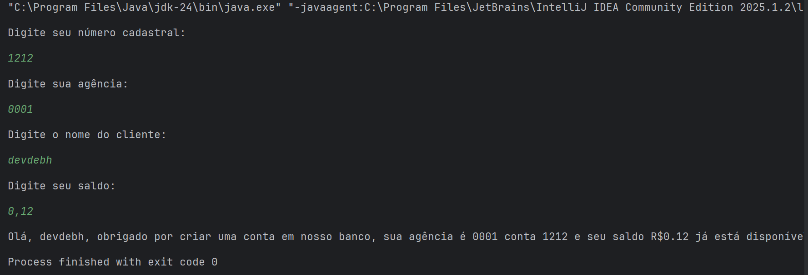

# 🏦 Conta Bancária no Terminal — Desafio DIO & Bradesco

Este repositório contém um desafio prático da **Trilha Java** oferecida pela **DIO** em parceria com o **Bradesco**, como parte de um **bootcamp de nível intermediário**. O exercício simula a criação de uma **conta bancária via terminal**, utilizando entrada de dados com `Scanner` e formatação de saída com base nas informações fornecidas pelo usuário.

> 💬 A proposta me permitiu aplicar conhecimentos de entrada/saída em Java, manipulação de variáveis e boas práticas com o console.

---

## 🚀 Tecnologias e Conceitos

- ☕ Java
- 📥 Entrada de dados com `Scanner`
- 📤 Impressão formatada
- 🧠 Manipulação de variáveis
- 🔁 Fluxo linear de execução

---

## 📂 Estrutura

```bash
📁 conta-banco-terminal/
 ├── .idea/                      # Configurações do projeto (IDE)
 ├── src/
 │   └──  ContaTerminal.java # Código principal com lógica de entrada e saída
 ├── .gitignore                 # Arquivos ignorados no controle de versão
 └── Conta Banco.iml            # Arquivo de configuração do IntelliJ
```

---

## 📌 Sobre o Exercício

O programa simula a abertura de uma conta bancária em um ambiente de terminal. Ele realiza os seguintes passos:

1. Solicita o número cadastral do cliente (inteiro).

2. Solicita o número da agência (string).

3. Solicita o nome completo do cliente (string).

4. Solicita o saldo inicial da conta (número decimal).

Ao final, imprime uma mensagem com todos os dados formatados de maneira organizada.



> 📌 O exercício reforçou práticas com Scanner, fluxo sequencial de código e o uso combinado de diferentes tipos de variáveis.

---
## ✅ Status do Projeto
- ✔️ Exercício finalizado com sucesso

- 🧠 Utilizado como base para revisões de entrada/saída

- 🧰 Estrutura organizada e pronta para refatorações

---
## 🧠 Motivação
Este desafio representa mais um passo na minha trajetória como desenvolvedora Java. Ele mostra meu esforço contínuo em construir uma base técnica forte, com foco em lógica, clareza e boas práticas.

> 🔎 Sinto constantemente a vontade de me atualizar, aprender e aprimorar minhas habilidades, sou uma fominha por tecnologia, graças a isso me dedico com curiosidade, empenho e técnica!

---

## 📬 Contribuições
Se você quiser deixar sugestões, abrir uma issue ou usar esse código como referência para seus próprios estudos, fique à vontade!
Compartilhar aprendizado também é evoluir 💜

   

> Criado com dedicação, lógica e 💜 por Déborah Nascimento
